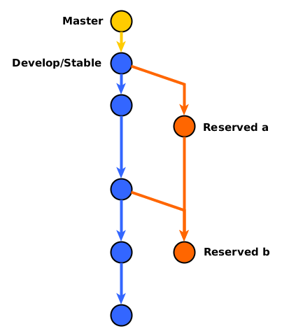
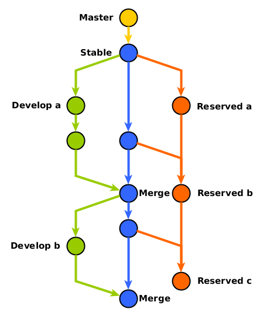

# Team GitHub风格指南

## 0. 前言

### 0.1 版本

- 1.0版本(2016.7.5)：缪宇飏(myyerrol)创建团队 GitHub 开发风格指南。本文档参考了很多网上的资料，并根据实际的需求，对内容进行了总结。新队员应该认真学习本指南，掌握 GitHub 基本的使用风格以及适用于本项目组的特定规则。如果有细节不统一的地方或者对本文档某处不是很认同，请在组内讨论统一之后，修改本指南。因为文档排版使用的是 Markdown 纯文本标记语言，也请后来者遵循本文档的开发方式，使用 Markdown 来修改、添加内容。

### 0.2 背景

对于开源项目来说，代码的管理至关重要。

## 1. GitHub 使用指南

> **Tip**
>
> 请先自学 Git 和 GitHub。

本指南假设各位已经对 Git 和 GitHub 的使用与原理有了比较清晰的理解。如果还不会使用，请先自学 Git 和 GitHub 之后，再看本指南。

以下是推荐的学习资源：

- [Git教程 - 掌握GitHub](http://www.worldhello.net/gotgithub/)
- [Git教程 - 廖雪峰的官方网站](http://www.liaoxuefeng.com/wiki/0013739516305929606dd18361248578c67b8067c8c017b000)
- [Git教程 - 简明指南](http://rogerdudler.github.io/git-guide/index.zh.html)
- 书《GitHub入门与实践》
- 书《Pro Git》

### 1.1 仓库

> **Tip**
>
> 仓库中应该包括 README.md、.gitignore 和 LICENSE 等文件。

在创建本地 ROS 包仓库的时候，请在仓库中包含以下所需文件：

- README.md：用来描述 ROS 包的功能、安装和使用方法等。编辑和修改此文件请使用 Markdown 语法。README.md 文件的内容最少应该由以下几点组成：包名、简介、功能、安装（可选）、使用。如果能有图片或架构图就更好了。具体例子请参考 [xm_arm_workspace](https://github.com/myyerrol/xm_arm_workspace)。
- .gitignore：添加到这个名单中的文件，将不会被 Git 版本管理软件所管理。
- LICENSE：用来描述 ROS 包发行所使用的软件开发协议。具体内容已经在 《ROS 风格指南》中进行了详细的介绍。

### 1.2 提交

> **Tip**
>
> 在编写提交描述时，第一个单词首字母要大写。

Yes:
``` bash
git commit -m "Add xm_arm_workspace package"
```

No:
``` bash
git commit -m "add xm_arm_workspace package"
```

### 1.3 分支

> **Tip**
>
> 请至少使用简单的 2 分支开发模式来管理 ROS 软件包。

分支是 Git 最为强大的地方，它是实现经典的 `Fork-Pull-Push` 开发模式的基础。具体如何创建、合并、推送、删除分支，请参考上面的学习资源。这里主要讨论代码版本的管理问题。

- 2 分支版本管理模式是目前我们团队 GitHub 仓库代码的管理模式。它的原理比较简单：每次都将修改提交到默认的 master 分支上。换句话说，就是 master 分支既作为最新的开发分支，又作为稳定分支。当 master 分支上的代码被修改的足够多时，就可以创建一个新的分支来保留当前 master 分支的所有状态。以后 master 分支会继续不断地前进，而保留分支则保存了某些历史节点的代码修改。简单来说，保留分支是 master 分支在不同开发时间点的备份，它并不会被修改或更新。保留分支的命名格式为：年-月-ROS 版本-devel，举个例子：15.10-indigo-devel。以下为 2 分支模式图：



- 3 分支版本管理模式是在 2 分支的基础上的一个改进。即从原先 master 分支分出一个开发分支，master 分支只作为当前稳定分支而存在，而所有最新的代码修改都是在开发分支上完成的。只有当开发分支上的新功能趋于稳定且没有 Bug 的时候，才可以将开发分支合并到 master 稳定分支上，这样就能保证存在于最新代码中的问题不会影响到原先的老代码。保留分支的使用则和上面介绍的相同。以下为 3 分支模式图：



结论：推荐使用 3 分支的 Git 开发模式。如果为了简化 GitHub 仓库的管理，使用 2 分支的模式也是可以的。

### 1.4 描述

> **Tip**
>
> 为每个在 GitHub 上的代码仓库编写尽可能详细的描述。

举例：


## 2. GitHub 管理指南

> **Tip**
>
> GitHub 组织管理员必看部分。

这部分主要是针对如何管理好我们整个团队 GitHub 组织仓库而写的。主要参考 [GitHub Help](https://help.github.com/categories/setting-up-and-managing-organizations-and-teams/) 官方资料。如果有哪位成员想成为 GitHub 组织管理员，一定要仔细阅读本章节。当然，其他成员也要认真学习才行。


### 2.1 组织

> **Tip**
>
> 组织仓库管理的核心是权限。

组织是非常适合管理基于多人协同开发模式的开源项目的。组织管理主要是针对两个方面。一个是团队角色的权限管理，另一个是基于团队的代码仓库的权限管理。

### 2.1.1 角色权限

> **Tip**
>
> 拥有者（Owners）的权限非常大，数量要被严格限制。

组织角色有两种。一个是拥有者（Owners），另一个是成员（Members）。

- 拥有者（Owners）：拥有组织管理的所有权限。因为其权限过于强大，所以这个角色数量必须被限定在很少的范围内。这里明确规定：**团队里只允许少数核心队员可以成为组织的拥有者**。
- 成员（Members）：组织的默认角色。拥有创建新团队（Team）、上传新代码、读写已有代码、可以在团队（Team）内部或之间相互交流和拥有团队维护者（Team Maintainer）头衔的权限。

其他具体请看 [GitHub 组织角色权限](https://help.github.com/articles/permission-levels-for-an-organization/) 介绍。

### 2.1.2 仓库权限

> **Tip**
>
> 仓库的权限有：读、写、管理三种。

拥有者（Owners）和拥有团队维护者（Team Maintainer）权限的成员（Members）可以管理团队（Teams）内部仓库的访问权限。每一个团队（Team）都可以拥有不同的代码仓库以及对仓库的访问权限。成员（Members）可以获得对仓库的权限有：

- 读（Read）。
- 写（Write）。
- 管理（Admin）。

组织的拥有者（Owners）可以添加任何仓库到任何团队（Teams）中去。而只拥有对某个仓库管理（Admin）权限的成员（Members）可以把这个仓库添加到他们所属的其他团队（Teams）中去。

一个组织的拥有者（Owner）可以将任何成员（Members）提升为一个或多个团队的维护者（Team Maintainer）。拥有团队维护者（Team Maintainer）头衔的成员（Members）可以获得权限为：

- 改变团队（Team）的名字、描述和可视化属性。
- 添加组织成员（Members）到团队（Team）中。
- 删除团队中（Team）的组织成员（Members）。
- 提升团队成员（Team Members）为团队维护者（Team Maintainers）。
- 删除团队（Team）对已有仓库的访问权限。

组织的拥有者（Owners）可以删除组织中的任何仓库。如果组织的成员（Members）对某些仓库有管理（Admin）权限，那他们只可以删除这些仓库。

其他具体请看 [GitHub 组织仓库权限](https://help.github.com/articles/repository-permission-levels-for-an-organization/)介绍。

**结论：以上介绍了很多概念，这里最后总结一下目前 GitHub 仓库的管理方案：**

- **团队里只允许少数核心队员可以成为组织的拥有者**。
- **每个团队（Team）里最多只能有 1 个团队维护者（Team Maintainers）。**
- **每个队员对自己在组织新创建的代码仓库拥有最高的管理（Admin）权限。其他队员当然只对这个仓库拥有默认的只读权限。**
- **由组织拥有者（Owners）负责添加仓库到相应的团队中去，并赋予仓库可以被写的权限。**
- **每个新成员默认对组织中所有仓库的权限是只读的，而每个团队（Team）内部成员（Members）对添加到自己团队（Team）中的仓库是可写的（前提条件是上面那条）。**
- **如果非常有必要，可以将团队（Team）中的某些代码仓库更改为管理（Admin）权限。但是不推荐这样做。**
- **团队新队员如果在规定提交代码仓库的一个月时间内，连一次提交记录都没有，就要被从组织中除名。**
